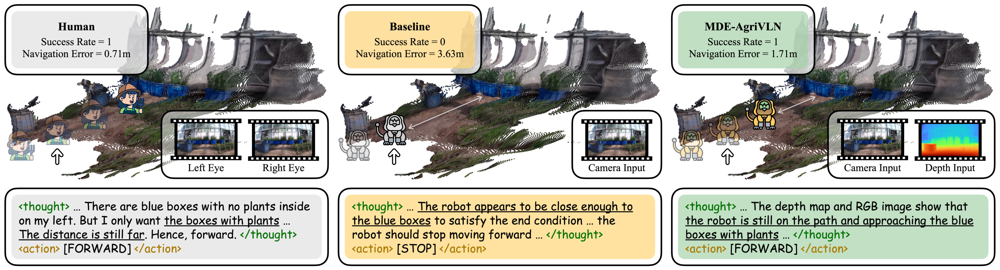
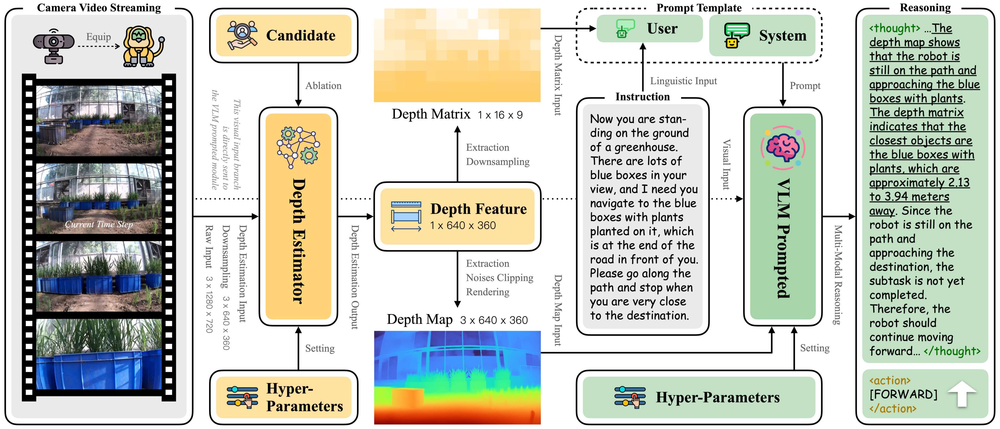

<div align="center">
<h1>MDE-AgriVLN: Agricultural Vision-and-Language Navigation with Monocular Depth Estimation</h1>
<a href="https://arxiv.org/abs/2512.03958"></a>

[Xiaobei Zhao](https://github.com/AlexTraveling)<sup>1</sup> · [Xingqi Lyu](https://github.com/AlexTraveling)<sup>1</sup> · [Xiang Li](https://faculty.cau.edu.cn/lx_7543/)<sup>1</sup>

<sup>1</sup>**[China Agricultural University](https://ciee.cau.edu.cn)**

xiaobeizhao2002@163.com, lxq99725@163.com, cqlixiang@cau.edu.cn


</div>

> MDE-AgriVLN v.s. Human and Baseline on a representative episode. In every method's section, the right images are the visual inputs at the time step $t = 6.2s$ (marked by the white arrows), the bottom textbox is the reasoning result at the same time step, and the top textbox is the evaluation result. Underline marks the pivotal reasoning thoughts.

## Updates
- [December 5th, 2025] We provide the detailed guidance to set up MDE-AgriVLN in a local environment.
- [December 4th, 2025] We open-source the complete codes of MDE-AgriVLN.
- [December 3rd, 2025] The paper “MDE-AgriVLN: Agricultural Vision-and-Language Navigation with Monocular Depth Estimation” is available for reading on [arXiv](https://arxiv.org/abs/2512.03958).

## Overview
Agricultural robots are serving as powerful assistants across a wide range of agricultural tasks, nevertheless, still heavily relying on manual operations or railway systems for movement. The AgriVLN method and the A2A benchmark pioneeringly extend Vision-and-Language Navigation (VLN) to the agricultural domain, enabling a robot to navigate to a target position following a natural language instruction. Unlike human binocular vision, most agricultural robots are only given a single camera for monocular vision, which results in limited spatial perception. 

To bridge this gap, we present the method of Agricultural Vision-and-Language Navigation with Monocular Depth Estimation (MDE-AgriVLN), in which we propose the MDE module generating depth features from RGB images, to assist the decision-maker on reasoning. When evaluated on the A2A benchmark, our MDE-AgriVLN method successfully increases Success Rate from 0.23 to 0.32 and decreases Navigation Error from 4.43m to 4.08m, demonstrating the state-of-the-art performance in the agricultural VLN domain.



> MDE-AgriVLN methodology illustration: The MDE module (yellow part) takes a single frame from a camera video streaming as input, to output the depth feature in two representation classifications. The base model (green part) simultaneously understand the instruction, RGB input and depth input, to reason the most appropriate low-level action with an explicit thought.

## Quick Start
<!-- We are clearing up all the codes of MDE-AgriVLN, which will be available in about one week. -->
1. Download the source codes of MDE-AgriVLN.
```bash
git clone git@github.com:AlexTraveling/MDE-AgriVLN.git
cd MDE-AgriVLN-main
```
2. Create a new conda environment, then install all the dependent packages.
```bash
conda create -n mde-agrivln python=3.11
conda activate mde-agrivln
pip install -r requirements.txt
```
3. Deploy the ollama environment following the [official guidance](https://github.com/ollama/ollama), then download the Large Language Model (LLM) and Vision-Language Model (VLM), for which we use DeepSeek-R1-32B and Qwen2.5-VL-32B as the default LLM and VLM, respectively, matching the setting in our paper.
```bash
ollama pull deepseek-r1:32b
ollama pull qwen2.5vl:32b
# if you want to use another model, just change the model name.
```
4. Deploy the monocular depth estimator of Depth Pro following the [official guidance](https://github.com/apple/ml-depth-pro).
5. Run the home_mde_agrivln.py file to start MDE-AgriVLN, in which all the six place classifications are available. The running results will be shown in terminal and saved in local.

Options:
- `--place -p`: The agricultural scene classification, for which you can set it to `farm`, `greenhouse`, `forest`, `mountain`, `garden` or `village`.
- `--representation -r` (optional): The representation paradigm of the MDE module, for which the default setting is `matrix`, and you can change it to `map` or `hybrid`.
- `--estimater -e` (optional): The monocular depth estimator of the MDE module, for which the default setting is `depth_pro` (Depth Pro), and you can change it to `depth_anything_v2` (Depth Anything V2) or `pixel-perfect_depth` (Pixel-Perfect Depth).

Here is an example:
```bash
python home_mde_agrivln.py -p greenhouse -r matrix -e depth_pro
```
## Demonstration
Here we share the video of the demonstration mentioned in our paper.

<p align="center">
  
</p>
<!--  -->

> Instruction: *Now you are standing on the ground of a greenhouse. There are lots of blue boxes in your view, and I need you navigate to the blue box with plants planted on it, which is at the end of the road in front of you. Please go along the path and stop when you are very close to the destination.*

## Acknowledgment
Thanks to Kota Kinabalu, Brunei, Penang and Siem Reap for the impressive traveling experiences, giving us a chilled vibe for writing. Thanks to Kathy Wang for being the participant offering the Human reasoning thoughts for the teaser figure in our paper. Thanks to Yuanquan Xu, the inspiration to us.

## Citation
If our paper or method is helpful for your research, welcome you use the following citation:
```bibtex
@inproceedings{MDE-AgriVLN,
  title={MDE-AgriVLN: Agricultural Vision-and-Language Navigation with Monocular Depth Estimation},
  author={Xiaobei Zhao and Xingqi Lyu and Xiang Li},
  booktitle={arXiv:2512.03958},
  year={2025}
}
```

## Communication
If you meet any problems with MDE-AgriVLN, welcome contacting the first author (Xiaobei Zhao, xiaobeizhao2002@163.com) to share your findings and thoughts.